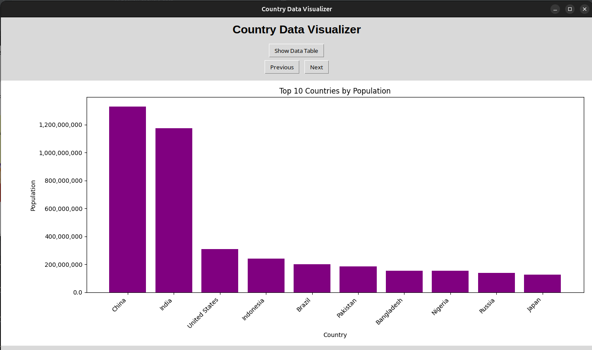
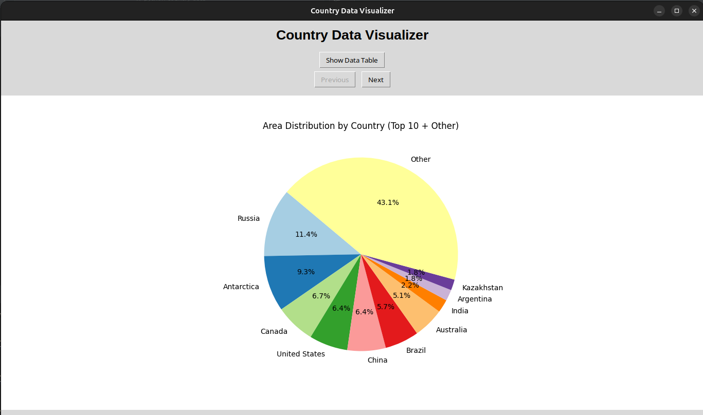
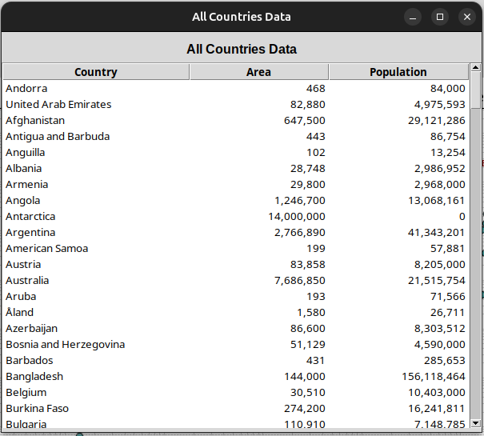

# Python Country Data

A public, MIT-licensed Python project for exploring and visualizing country data using Matplotlib. Designed for learning, sharing, and portfolio demonstration.

## Features
- Modular code structure for easy expansion
- Separate functions for pie, bar, and scatter plots
- Ready for data analysis and visualization
- MIT license for open sharing

## How it works

1. **Data Fetching:**
   - The application fetches country data (name, population, area) from a sample website using the `get_country_details` function in `src/get_country_details.py`.
   - Data is parsed and cleaned for use in visualizations.

2. **Visualization:**
   - The `create_country_plots` function in `src/visualize_countries.py` generates three types of plots using Matplotlib:
     - Pie chart of country areas (top 10 + other)
     - Bar chart of top 10 countries by population
     - Scatter plot of area vs. population (log scale)

3. **GUI Application:**
   - The Tkinter-based GUI (`CountryDataApp` in `src/tk_app.py`) displays the plots and provides navigation buttons to cycle through them.
   - Users can open a data table window to view all countries, sort columns, and save the current plot as an image.

4. **Extensibility:**
   - The code is modular, making it easy to add new data sources, plots, or features.

---

## Getting Started
1. Clone the repository
2. Install dependencies:
   ```bash
   pip install -r requirements.txt
   ```
3. (Optional) Add your own data to the `data/` directory
4. To fetch country details from the web and visualize them in a desktop GUI (Tkinter), run:
   ```bash
   python main.py
   ```
   This opens a window where you can cycle through the plots, view a table of the top 10 countries by population, and save any plot as an image. This is the main and recommended way to explore the data visually.

5. Start coding in `src/` for your own features

## Plotting Functions
The codebase provides modular plotting functions in `src/visualize_countries.py`:
- `create_pie_chart(names, values, title, colors)`
- `create_bar_chart(names, values, title, ylabel, color)`
- `create_scatter_plot(areas, populations, country_names)`
These are used by `create_country_plots()` to generate the main visualizations.

## Project Structure
```
python-country-data/
├── src/
├── data/
├── notebooks/
├── tests/
├── docs/
├── requirements.txt
├── README.md
├── LICENSE
└── .gitignore
```

## License
MIT License. See [LICENSE](LICENSE) for details.

## Screenshots

Below are some screenshots of the Country Data Visualizer app in action:


*Main window showing the bar chart of top 10 countries by population.*



*Pie chart of country areas (top 10 + other).* 


*Popup window displaying the sortable data table of all countries.*

---

## Author

**msjackiebrown**  
[GitHub](https://github.com/msjackiebrown)  
